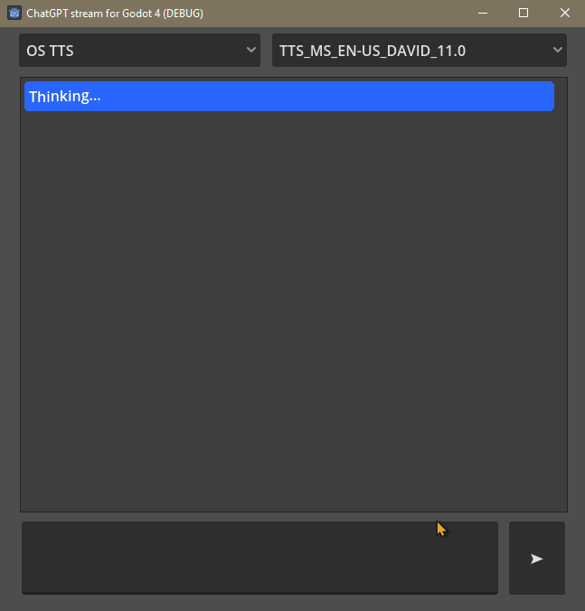

# ChatGPT stream for Godot 4

# Functionalities

This project combines a few features to produce a smooth chat experience with ChatGPT:

- OpenAI's ChatGPT with stream enabled.
- The [HTTPSSEClient add-on by Kyle Szklenski](https://github.com/WolfgangSenff/HTTPSSEClient), ported to Godot 4 and adapted to this project, allowing for showing the AI response before the model generates the full responses. This reduces dramatically the delay in long replies, specially if GPT-4 is used.
- The godot-elevenlabs-tts script , part of the [Gotot 4 AI NPC example by teddybear082](https://github.com/teddybear082/godot4-ai-npc-example/), for high quality text-to-speech using ElevenLabs API.
- Text-to-speech using the built-in Godot 4 TTS system, that relies on the OS TTS voices.
- A queuing system for being able to push several AI messages one after the other, and process them at whatever speed is desired.
- Godot's RichTextLabel nodes using BBcode
- AI's status messages to present a "Thinking..." message during the small delay before starting to receive the ChatGPT reply.
- Word by word injection of the AI message into the RichTextLabel with independent control of the speed in which words appear. So even if the model is able to provide all the words at a very fast speed you may choose to present them to the user at a slower speed.

For the best results, the delay for the word by word speed, should be set to a value bigger than the delay of the LLM model itself.

# How to use it?

1. This project was created with Godot 4.1.1, for maximum compatibility please using that version.

2. Insert your OpenAI API key at the top of the chat.gd script

3. Only if you want TTS by ElevenLabs, insert your ElevenLabs API key in the script res://scenes/godot-elevenlabs-tts/ElevenLabsTTS_modified.gd.

4. In the chat.gd script, in the `_ready` function, there is a "system_message" dictionary that you can edit so you give the LLM model your own instructions on how it should behave.

5. The render is "Compatibility" so you should be able to export this for any platform, including the web.

# Limitations

- I could not get the ElevenLabs text-to-speech to work using the `use_stream_mode=true` which should improve latency for voice output. It is set to false by default.

# License

License is MIT for everything unless otherwise specified in the respective files. Please check the included LICENSE for more details on the license and attributions.
